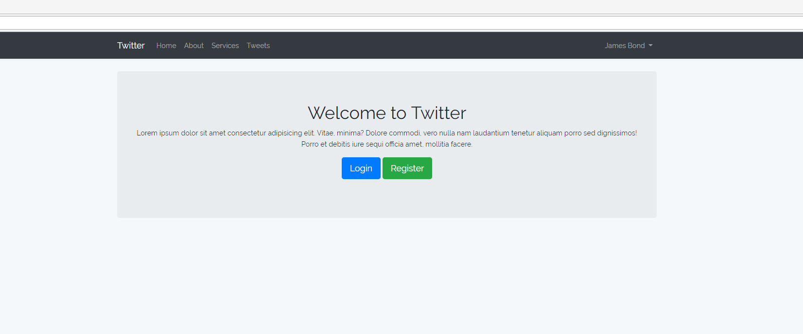
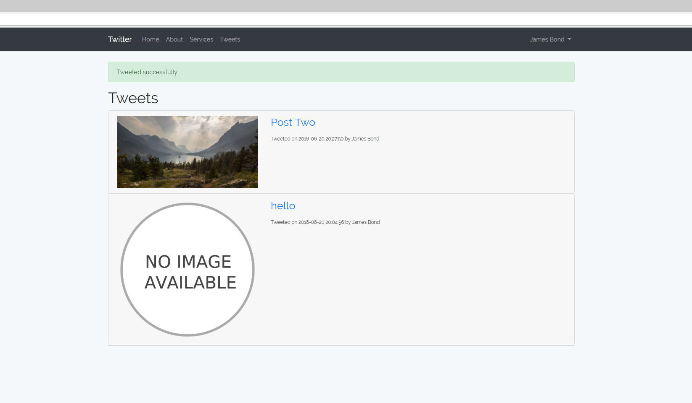
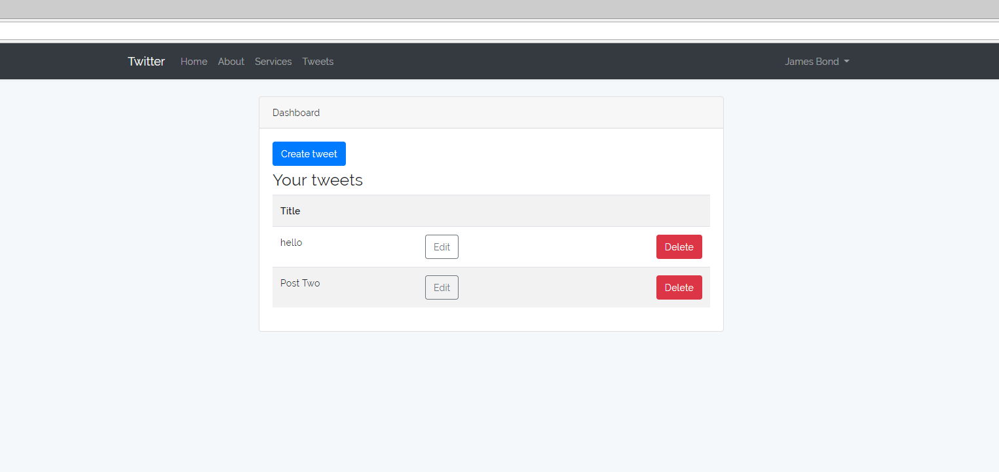
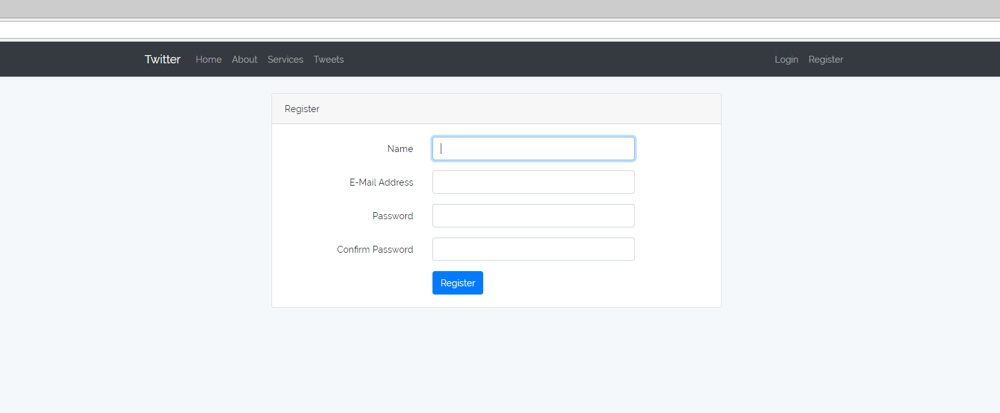

# Twitter copy

I've used various Laravel tutorials to guide me towards getting the foundations for this project down. I'm using Bootstrap 4 to style my pages.

---

---

---

---

---

## Getting Started

I use the [XAMPP](https://www.apachefriends.org/index.html) stack to develop & test this project locally.
I installed [Laravel](https://laravel.com/) using [Composer](https://getcomposer.org/).

---

## Built With

Laravel

---

## License

The Laravel framework is open-sourced software licensed under the [MIT license](https://opensource.org/licenses/MIT).
Bootstrap is open-sourced licensed under the [MIT license](https://opensource.org/licenses/MIT).

---

## Author

**Skye Gill** - [Skyerus](https://github.com/Skyerus)